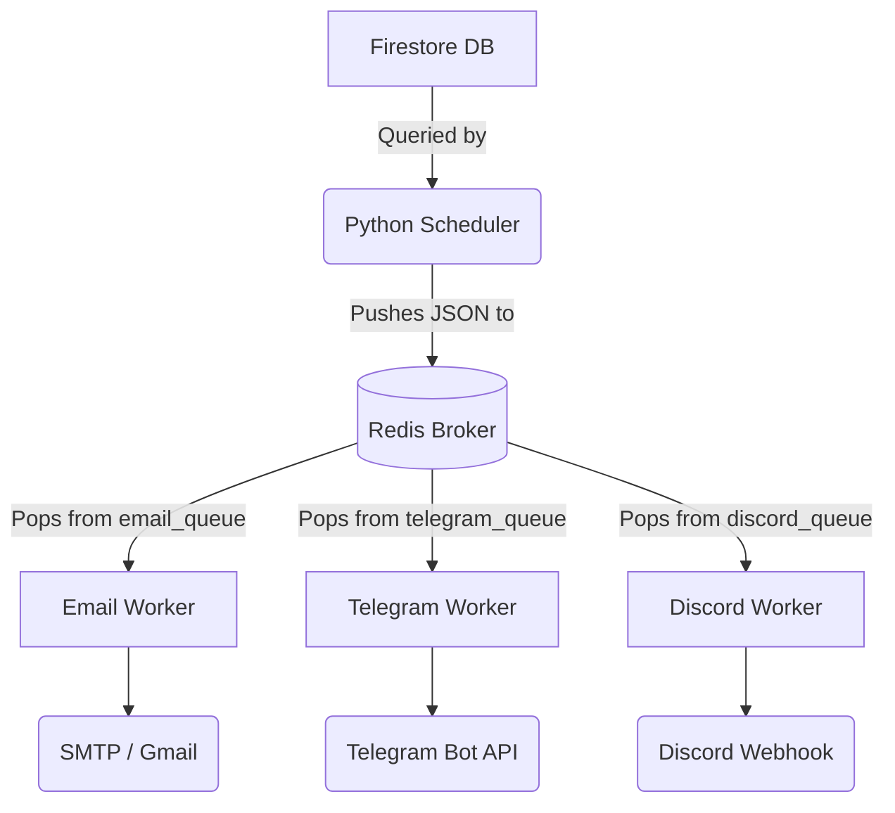

# Event Reminder — Database & Architecture Schema

This document details how data is stored in Firestore and how information flows between the Next.js UI, the Redis queues, and the Python workers.

---

## 1. Firestore Database Schema

The application uses Cloud Firestore with two primary root collections: `users` and `birthdays`.

### `users` Collection

Stores user profiles and global notification preferences.
**Document ID**: Firebase Auth UID

```json
{
  "email": "user@example.com",
  "createdAt": 1711200000000,
  "notifications": {
    "reminderTiming": "-15m", // Enum: 'midnight', '-15m', '+15m', '+1h', '+6h', '+10h'
    "email": {
      "enabled": true,
      "address": "user@example.com",
      "verified": true
    },
    "telegram": {
      "enabled": true,
      "chatId": "123456789",
      "verified": true
    },
    "discord": {
      "enabled": false,
      "webhookUrl": "https://discord.com/api/webhooks/...",
      "verified": false
    }
  }
}
```

### `birthdays` Collection

Stores individual tracked events for users.
**Document ID**: Auto-generated UUID (`crypto.randomUUID()`)

```json
{
  "id": "abc-123-def",
  "userId": "firebase_auth_uid", // Foreign key to users collection
  "name": "Jane Doe",
  "association": "College Friend", // Optional, formerly known as 'company'
  "type": "birthday", // Enum: 'birthday', 'anniversary', 'custom'
  "birthdate": "1994-06-15", // Format: YYYY-MM-DD
  "unknownYear": false, // If true, birthdate might be "1900-MM-DD" or similar fallback
  "meetDate": "2018-09-01", // Optional date they first met (YYYY-MM-DD)
  "timezone": "America/New_York", // Standard IANA timezone string
  "createdAt": 1711200500000
}
```

---

## 2. Notification Data Flow

The architecture decouples the event scanning from the notification dispatching using Redis as a message broker.



### 1. The Scheduler (`python-workers/scheduler/main.py`)
- Runs continuously (checks daily or hourly).
- Iterates over all `users`.
- Queries the `birthdays` collection for events belonging to that user where the `birthdate` month and day match the current date in the event's `timezone`.
- Note: It also offsets the exact dispatch time based on the user's global `reminderTiming` preference (e.g., waiting until 10:00 AM if `+10h` is set).

### 2. Redis Message Format

When the scheduler determines an event needs a notification, it pushes a JSON string into specific Redis lists (`email_queue`, `telegram_queue`, `discord_queue`) based on the user's enabled channels.

**Queue Payload Schema:**
```json
{
  "userId": "firebase_auth_uid",
  "user": {
    // The full user document from Firestore (see schema above)
  },
  "birthday": {
    // The full birthday document from Firestore (see schema above)
  }
}
```

### 3. The Workers
- Run infinite loops doing `brpop` (blocking pop) on their respective Redis lists.
- **Stateless**: They do not query Firestore. They rely entirely on the payload sent by the scheduler.
- **Compute**: They calculate the age/duration (e.g., `Current Year - Event Year`) if `unknownYear` is false.
- **Dispatch**: They format the message (HTML for email, Markdown for Telegram, Rich Embed for Discord) and send it via HTTP requests to external APIs.
