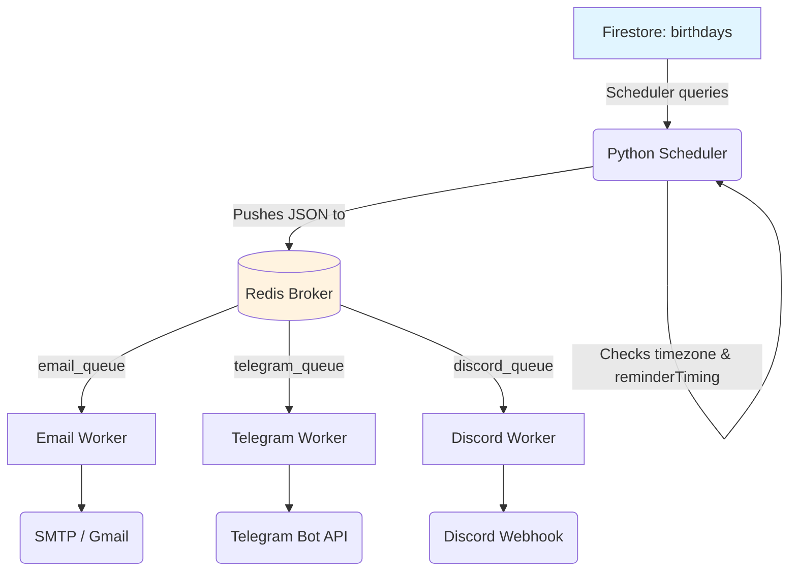
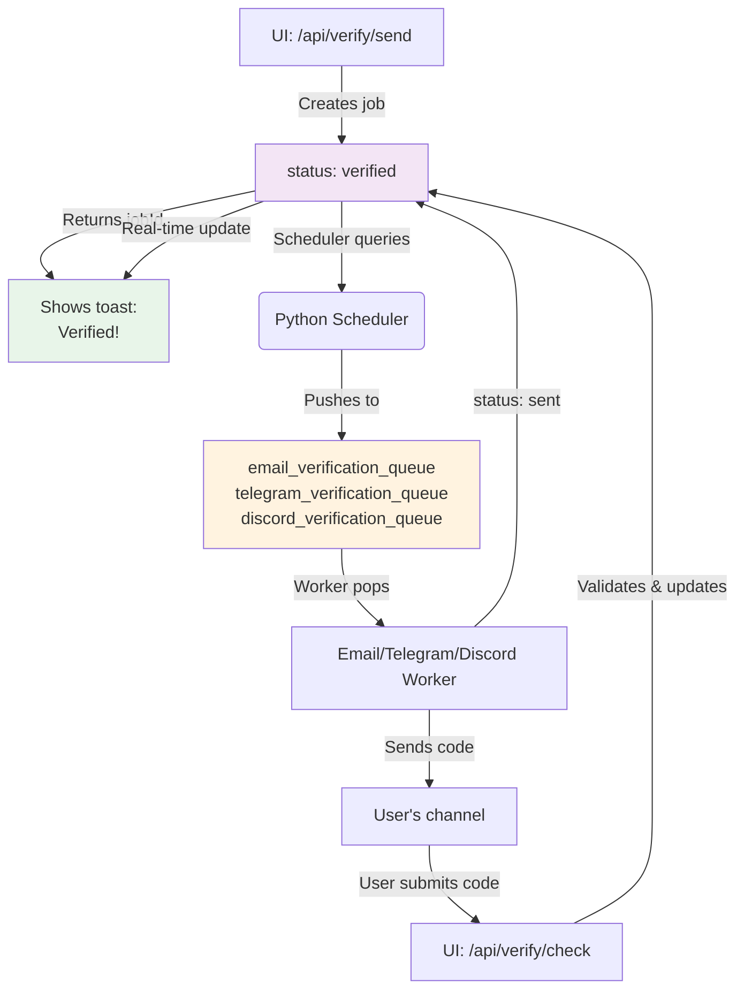

# Event Reminder — Database & Architecture Schema

This document details how data is stored in Firestore and how information flows between the Next.js UI, the Redis queues, and the Python workers.

---

## 1. Firestore Database Schema

The application uses Cloud Firestore with two primary root collections: `users` and `birthdays`.

### `users` Collection

Stores user profiles and global notification preferences.
**Document ID**: Firebase Auth UID

```json
{
  "email": "user@example.com",
  "createdAt": 1711200000000,
  "notifications": {
    "reminderTiming": "-15m", // Enum: 'midnight', '-15m', '+15m', '+1h', '+6h', '+10h'
    "email": {
      "enabled": true,
      "address": "user@example.com",
      "verified": true
    },
    "telegram": {
      "enabled": true,
      "chatId": "123456789",
      "verified": true
    },
    "discord": {
      "enabled": false,
      "webhookUrl": "https://discord.com/api/webhooks/...",
      "verified": false
    }
  }
}
```

### `birthdays` Collection

Stores individual tracked events for users.
**Document ID**: Auto-generated UUID (`crypto.randomUUID()`)

```json
{
  "id": "abc-123-def",
  "userId": "firebase_auth_uid", // Foreign key to users collection
  "name": "Jane Doe",
  "association": "College Friend", // Optional, formerly known as 'company'
  "type": "birthday", // Enum: 'birthday', 'anniversary', 'custom'
  "birthdate": "1994-06-15", // Format: YYYY-MM-DD
  "unknownYear": false, // If true, birthdate might be "1900-MM-DD" or similar fallback
  "meetDate": "2018-09-01", // Optional date they first met (YYYY-MM-DD)
  "timezone": "America/New_York", // Standard IANA timezone string
  "createdAt": 1711200500000
}
```

### `email_jobs` Collection

Stores asynchronous email verification jobs (queue-based pattern).
**Document ID**: Auto-generated UUID in `id` field

```json
{
  "id": "550e8400-e29b-41d4-a716-446655440000", // UUID
  "userId": "firebase_auth_uid", // Foreign key to users collection
  "type": "verification", // Enum: 'verification'
  "channel": "email", // Enum: 'email', 'telegram', 'discord'
  "identifier": "user@example.com", // Email address or channel-specific identifier
  "code": "123456", // 6-digit verification code
  "status": "pending", // Enum: 'pending' → 'queued' → 'sent' / 'failed' / 'verified'
  "createdAt": 1711200600000, // Timestamp when job was created
  "expiresAt": 1711201500000, // Timestamp when job expires (15 minutes)
  "verifiedAt": null // Timestamp when user verified the code (null until verified)
}
```

**Status Transitions:**
- `pending` → `queued`: Scheduler picks up job and pushes to Redis queue
- `queued` → `sent`: Email worker successfully sent verification email
- `queued` → `failed`: Email worker failed to send (retry in next cycle)
- `sent` → `verified`: User submitted correct code via `/api/verify/check`

---

## 2. Notification Data Flow

The architecture uses two parallel flows: **Birthday Reminders** and **Email Verification** (both queue-based patterns using Firestore, Redis, and Python workers).

### Birthday Reminder Flow



**Reminder Queue Payload:**
```json
{
  "userId": "firebase_auth_uid",
  "user": { ... },
  "birthday": { ... }
}
```

### Email Verification Flow



**Verification Job Payload (in Redis queue):**
```json
{
  "id": "uuid",
  "userId": "firebase_auth_uid",
  "type": "verification",
  "channel": "email",
  "identifier": "user@example.com",
  "code": "123456",
  "createdAt": 1711200600000,
  "expiresAt": 1711201500000
}
```

### Redis Idempotency (Reminder Flow)

The scheduler prevents duplicate birthday reminder notifications by reserving a send key before dispatching:

```text
sent:{userId}:{birthdayId}:{YYYY-MM-DD}
```

### Key Differences: Reminders vs Verification

| Aspect | Reminder | Verification |
|--------|----------|--------------|
| **Trigger** | Scheduler (daily schedule) | User action (enable notification) |
| **Job Storage** | No persistence (stateless) | Firestore `email_jobs` collection |
| **Expiration** | Idempotency key in Redis | 15 minutes in Firestore |
| **Status Tracking** | Implicit (sent if no error) | Explicit (pending → queued → sent → verified) |
| **Real-time UI** | Polling `/api/sync-stats` | Firebase `onSnapshot()` listener |
| **Retry** | Scheduler loop (24h window) | Scheduler loop every 60s |

### Scheduler Operation

The scheduler (`python-workers/scheduler/main.py`) runs continuously with two processes:

**1. Birthday Reminder Process** (every hour)
- Queries `users` and `birthdays` collections
- Calculates which events occur today (in each user's timezone)
- Checks idempotency key: `sent:{userId}:{birthdayId}:{YYYY-MM-DD}`
- Pushes to channel-specific queues: `email_queue`, `telegram_queue`, `discord_queue`

**2. Email Verification Process** (every 60 seconds)
- Queries `email_jobs` where `status == 'pending'` and `expiresAt > now`
- Pushes to verification queues: `email_verification_queue`, `telegram_verification_queue`, `discord_verification_queue`
- Updates job `status` to `queued`

### Workers (Stateless Processing)

All workers run infinite loops doing `BRPOP` (blocking pop) on their respective Redis queues:

**Email Worker**
- Listens to: `email_queue` (reminders) + `email_verification_queue` (codes)
- Sends via: SMTP
- Updates Firestore with status: `sent` or `failed`

**Telegram Worker**
- Listens to: `telegram_queue` (reminders) + `telegram_verification_queue` (codes)
- Sends via: Telegram Bot API
- Returns: 200 OK (no Firestore persistence for reminders)

**Discord Worker**
- Listens to: `discord_queue` (reminders) + `discord_verification_queue` (codes)
- Sends via: Discord Webhook
- Returns: 204 No Content (no Firestore persistence for reminders)
